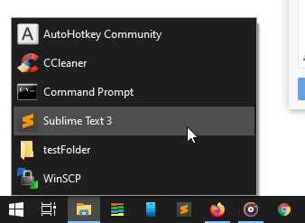
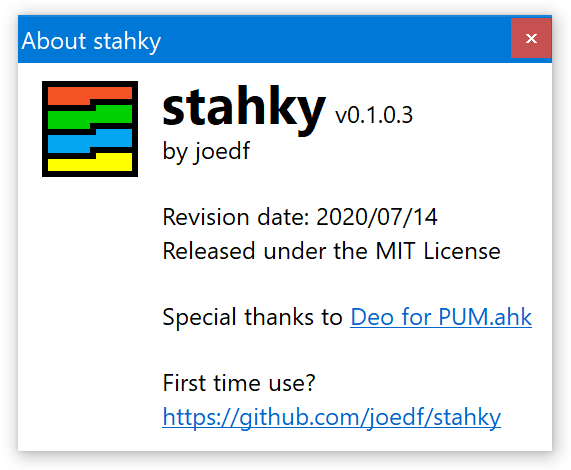
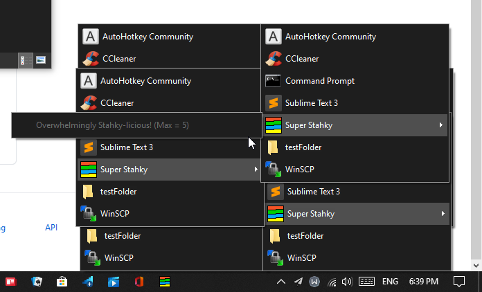

#  stahky 简体中文翻译版

本项目对stahky的贡献只有中文翻译，若上游有更新将尽快同步。

再次感谢[joedf](https://github.com/joedf)的贡献！

-----------------------------------------------------------------------------

基于 AutoHotkey (AHK) 的 [stacky](https://github.com/pawelt/stacky) 实现，适用于 Windows 10 和 11。
  
提供大量自定义选项，详见下文！

获取最新版本请访问[此处](https://github.com/joedf/stahky/releases)。

## 使用方法
- 将包含快捷方式、程序和文件的文件夹拖放到 Stahky 上
  - 一个可固定到任务栏的图标 / 快捷方式将在 Stahky 所在目录创建。
  - 在固定之前，你应该编辑该快捷方式的图标。
  - 一旦固定，你可以删除该快捷方式文件。
  - 注意：如果你不希望某些文件出现在 Stahky 菜单中，可以将它们设置为隐藏。
  - 注意：你可以拖放一个文件夹以及一个 stahky ini 配置文件，以便为每个快捷方式使用单独的设置。
- 外观、DPI、偏移量等设置
  - 颜色在首次运行时自动确定
  - 编辑 stahky.ini 以指定特定颜色、偏移量（x 或 y）、使用 DPI 进行大小和位置计算等...
  - `SortFoldersFirst` 选项允许你在每个菜单中将文件夹优先显示在顶部。
  - 使用 `PUM_flags` 来使用 [PUM.ahk 的标志选项](res/docs/PUM_documentation.pdf)【[参考用的中文版在这里](res/docs/PUM_documentation_CN.pdf)】，例如 `hleft` 表示水平左对齐，`hcenter` 表示水平居中，或 `noanim` 表示无淡入动画。你可以在 ini 配置文件中使用多个标志，例如 `PUM_flags=hleft noanim`
  - 在 ini 配置文件中使用 `ShowAtMousePosition=1` 可以让菜单在当前鼠标位置显示，无论任务栏在哪里。但是，如果使用此模式，`PUM_flags` 的值将被忽略。
  - 字体可以通过以下 ini 配置文件选项进行自定义：
      - `fontName` (默认为 `Segoe UI`)
      - `fontSize` (默认为 `9`)
      - `fontWeight` (默认为 `400`)
      - `fontItalic` (默认为 `0`，表示否)
      - `fontStrike` (默认为 `0`，表示否)
      - `fontUnderline` (默认为 `0`，表示否)
- 子菜单
  - 你可以使用一个普通文件夹并自定义其图标（在属性中）
    - 如果你希望打开文件夹而不是拥有子菜单，可以使用指向文件夹的快捷方式。
  - 你可以在文件夹内放置 stahky 快捷方式以创建自定义子菜单。非常 Stahky！
    - 具有循环引用的 Stahky 将被递归深度设置 `STAHKY_MAX_DEPTH` 限制（默认为 5）。
- 在 Stahky 菜单中打开文件夹
  - 在 ini 配置文件中使用 `ShowOpenCurrentFolder=1` 可以在所有文件夹上显示“打开此文件夹...”选项。
  - 按下 <kbd>鼠标中键</kbd> / <kbd>MButton</kbd> 可以
    - 在 stahky 上打开其目标文件夹以便轻松编辑。
    - 在任何项目上打开其父文件夹。
    - 在 ini 配置文件中设置 `exitAfterFolderOpen=0` 可以在打开文件夹后保持 Stahky 显示在屏幕上。
- 设计为以编译后的二进制文件运行（最佳体验），但也可以直接执行脚本。
- 可以使用 `/config` 参数在运行时指定要使用的 ini 配置文件，例如 `Stahky.exe /stahky "C:/my/folder" /config "C:/my/stahky/config/file.ini"`
- 按下 <kbd>Shift</kbd>+<kbd>Win</kbd>+<kbd>a</kbd> 或在任何 stacky 项目上右键单击 (<kbd>RButton</kbd>) 可以显示关于/首次使用对话框，以便轻松检查版本和其他信息。
- 如果 Stahky 加载时间过长，它会警告你包含了过大的文件夹。
  - 这个时间限制 `STAHKY_MAX_RUN_TIME` 可以更改，但最小等待时间为 1000 毫秒，最大为 10 秒（默认为 3500 毫秒）。

-----------------------------------------------------------------------------

## 简体中文版编译注意事项

编译中文版的时候，需要提前把翻译过的文件的编码，从 `UTF-8` 改成 `UTF-8 with BOM` ，否则会报错并在报错信息里提示乱码，或者错误的报错信息。

推测是由于AHKv1对编码敏感造成的。

-----------------------------------------------------------------------------
## 截图

